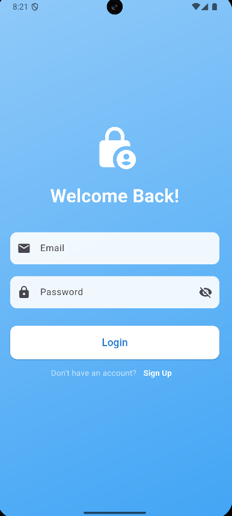
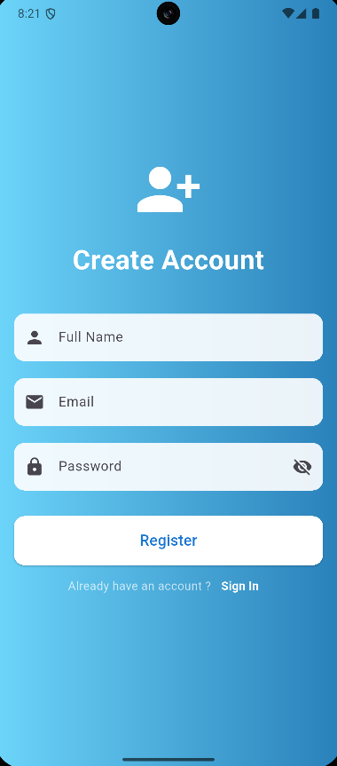
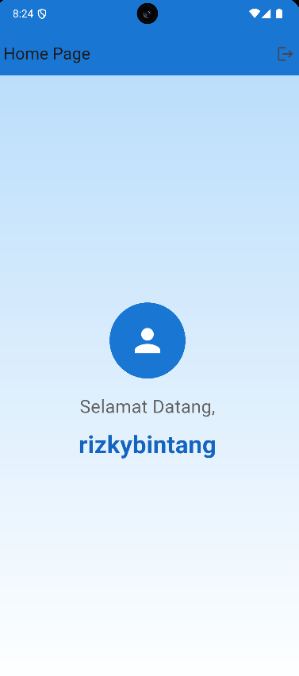
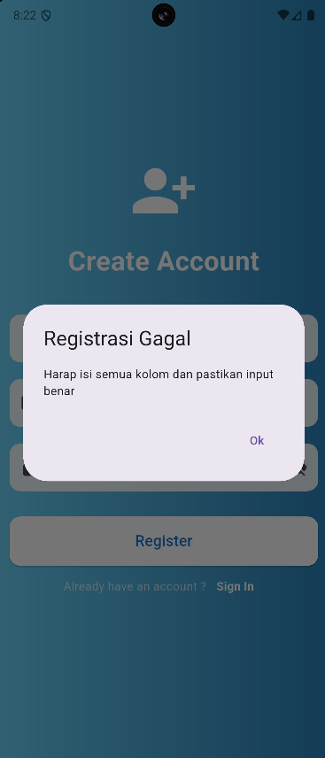
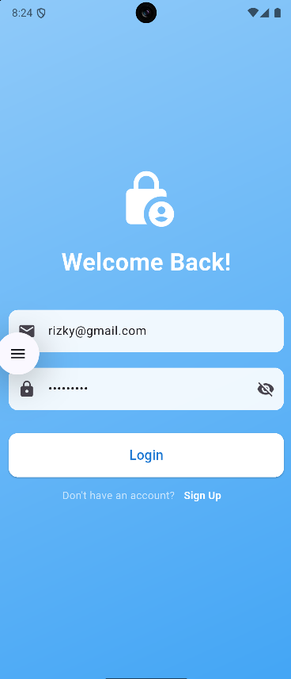
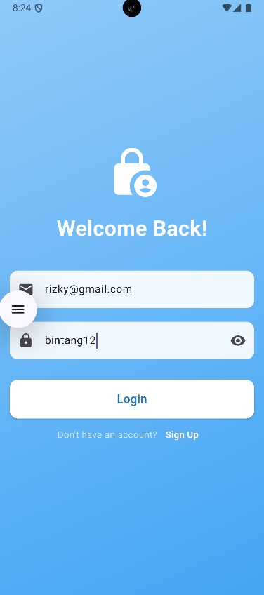

# Form Login dan Registrasi pada Flutter

## Laporan latihan

*Validasi Input*
---
### 1. TUJUAN PEMBELAJARAN
Merancang dan membuat layout halaman Login dan Registrasi.

Menggunakan widget dasar Flutter seperti Scaffold, Column, TextField, dan ElevatedButton.

Mengimplementasikan navigasi antar halaman menggunakan Navigator.

Mengelola state sederhana dan menyimpan data input pengguna.

Memahami event handling seperti aksi tombol login/registrasi.

### 2. ALAT YANG DIBUTUHKAN
Flutter SDK

Android Studio / VS Code (dengan ekstensi Flutter)

Emulator Android/iOS atau perangkat fisik

### 3. ANALISIS PROGRAM

Tempat awal aplikasi dijalankan, sekaligus untuk menentukan halaman pertama yang muncul misalnya halaman login atau homepage

#### lib/main.dart

dart
```
import 'package:flutter/material.dart';
import 'login_page.dart';

void main() {
  runApp(const MyApp());
}

class MyApp extends StatelessWidget {
  const MyApp({super.key});

  @override
  Widget build(BuildContext context) {
    return MaterialApp(
      title: 'Flutter Login UI',
      theme: ThemeData(primarySwatch: Colors.blue),
      debugShowCheckedModeBanner: false,
      home: const LoginPage(),
    );
  }
}
```

#### login_page.dart

Halaman ini berisi form login dengan input email dan password. Kalau datanya benar, pengguna masuk ke homepage. Kalau salah, akan muncul pesan gagal login
```
import 'package:flutter/material.dart';
import 'register_page.dart';
import 'home_page.dart';
import 'data/user_data.dart';
import 'package:shared_preferences/shared_preferences.dart';

class LoginPage extends StatefulWidget {
  const LoginPage({super.key});

  @override
  _LoginPageState createState() => _LoginPageState();
}

class _LoginPageState extends State<LoginPage> {
  final _emailController = TextEditingController();
  final _passwordController = TextEditingController();
  bool _obsecurePassword = true;

  void _login() async {
    String email = _emailController.text.trim();
    String password = _passwordController.text.trim();

    if (userData.containsKey(email) &&
        userData[email]!['password'] == password) {
      final prefs = await SharedPreferences.getInstance();
      await prefs.setBool("isLoggedIn", true);
      await prefs.setString("fullName", userData[email]!['fullName']!);

      Navigator.pushReplacement(
        context,
        MaterialPageRoute(
          builder: (context) =>
              HomePage(fullName: userData[email]!['fullName']!),
        ),
      );
    } else {
      showDialog(
        context: context,
        builder: (context) {
          return AlertDialog(
            title: const Text('Login Gagal'),
            content: const Text('Email atau password salah.'),
            actions: [
              TextButton(
                onPressed: () => Navigator.pop(context),
                child: const Text('Ok'),
              ),
            ],
          );
        },
      );
    }
  }

  @override
  Widget build(BuildContext context) {
    return Scaffold(
      body: Container(
        padding: const EdgeInsets.symmetric(horizontal: 24.0),
        decoration: BoxDecoration(
          gradient: LinearGradient(
            colors: [Colors.blue.shade200, Colors.blue.shade400],
            begin: Alignment.topLeft,
            end: Alignment.bottomRight,
          ),
        ),
        child: Center(
          child: SingleChildScrollView(
            child: Column(
              mainAxisAlignment: MainAxisAlignment.center,
              crossAxisAlignment: CrossAxisAlignment.stretch,
              children: <Widget>[
                const Hero(
                  tag: "appIcon",
                  child: Icon(Icons.lock_person, size: 80, color: Colors.white),
                ),
                const SizedBox(height: 20),
                const Text(
                  'Welcome Back!',
                  textAlign: TextAlign.center,
                  style: TextStyle(
                    color: Colors.white,
                    fontSize: 32,
                    fontWeight: FontWeight.bold,
                  ),
                ),
                const SizedBox(height: 40),
                TextField(
                  controller: _emailController,
                  keyboardType: TextInputType.emailAddress,
                  decoration: InputDecoration(
                    hintText: 'Email',
                    filled: true,
                    fillColor: Colors.white.withOpacity(0.9),
                    prefixIcon: const Icon(Icons.email),
                    border: OutlineInputBorder(
                      borderRadius: BorderRadius.circular(12),
                      borderSide: BorderSide.none,
                    ),
                  ),
                ),
                const SizedBox(height: 20),
                TextField(
                  controller: _passwordController,
                  obscureText: _obsecurePassword,
                  decoration: InputDecoration(
                    hintText: 'Password',
                    filled: true,
                    fillColor: Colors.white.withOpacity(0.9),
                    prefixIcon: const Icon(Icons.lock),
                    border: OutlineInputBorder(
                      borderRadius: BorderRadius.circular(12),
                      borderSide: BorderSide.none,
                    ),
                    suffixIcon: IconButton(
                      icon: Icon(
                        _obsecurePassword
                            ? Icons.visibility_off
                            : Icons.visibility,
                      ),
                      onPressed: () {
                        setState(() {
                          _obsecurePassword = !_obsecurePassword;
                        });
                      },
                    ),
                  ),
                ),
                const SizedBox(height: 30),
                ElevatedButton(
                  onPressed: _login,
                  style: ElevatedButton.styleFrom(
                    padding: const EdgeInsets.symmetric(vertical: 16),
                    backgroundColor: Colors.white,
                    foregroundColor: Colors.blue.shade700,
                    shape: RoundedRectangleBorder(
                      borderRadius: BorderRadius.circular(12),
                    ),
                  ),
                  child: const Text('Login', style: TextStyle(fontSize: 18)),
                ),
                Row(
                  mainAxisAlignment: MainAxisAlignment.center,
                  children: [
                    const Text(
                      "Don't have an account?",
                      style: TextStyle(color: Colors.white70),
                    ),
                    TextButton(
                      onPressed: () {
                        Navigator.push(
                          context,
                          MaterialPageRoute(
                            builder: (context) => const RegisterPage(),
                          ),
                        );
                      },
                      child: const Text(
                        'Sign Up',
                        style: TextStyle(
                          color: Colors.white,
                          fontWeight: FontWeight.bold,
                        ),
                      ),
                    ),
                  ],
                ),
              ],
            ),
          ),
        ),
      ),
    );
  }
}
```

#### register_page.dart

Halaman ini berisi form registrasi untuk memasukkan nama lengkap, email, dan password. Data akan disimpan sebagai user baru. Jika berhasil, akan muncul notifikasi sukses lalu diarahkan kembali ke halaman login
```
import 'package:flutter/material.dart';
import 'data/user_data.dart';

class RegisterPage extends StatefulWidget {
  const RegisterPage({super.key});

  @override
  _RegisterPageState createState() => _RegisterPageState();
}

class _RegisterPageState extends State<RegisterPage> {
  final _fullNameController = TextEditingController();
  final _emailController = TextEditingController();
  final _passwordController = TextEditingController();
  bool _obscurePassword = true;

  void _register() {
    String fullName = _fullNameController.text.trim();
    String email = _emailController.text.trim();
    String password = _passwordController.text.trim();

    bool validasiAt = email.contains('@');
    bool validasiPanjang = password.length > 6;

    if (fullName.isNotEmpty &&
        email.isNotEmpty &&
        password.isNotEmpty &&
        validasiAt &&
        validasiPanjang) {
      userData[email] = {'fullName': fullName, 'password': password};

      showDialog(
        context: context,
        builder: (context) => AlertDialog(
          title: const Text('Register Berhasil'),
          content: const Text('Akun anda berhasil dibuat. Silahkan login'),
          actions: [
            TextButton(
              onPressed: () {
                Navigator.pop(context);
                Navigator.pop(context);
              },
              child: const Text('OK'),
            ),
          ],
        ),
      );
    } else {
      showDialog(
        context: context,
        builder: (context) => AlertDialog(
          title: const Text('Registrasi Gagal'),
          content: const Text('Harap isi semua kolom dan pastikan input benar'),
          actions: [
            TextButton(
              onPressed: () => Navigator.pop(context),
              child: const Text("Ok"),
            ),
          ],
        ),
      );
    }
  }

  @override
  Widget build(BuildContext context) {
    return Scaffold(
      body: Container(
        padding: const EdgeInsets.symmetric(horizontal: 24.0),
        decoration: const BoxDecoration(
          gradient: LinearGradient(
            colors: [Color(0xFF6DD5FA), Color(0xFF2980B9)],
            begin: Alignment.topLeft,
            end: Alignment.topRight,
          ),
        ),
        child: Center(
          child: SingleChildScrollView(
            child: Column(
              mainAxisAlignment: MainAxisAlignment.center,
              crossAxisAlignment: CrossAxisAlignment.stretch,
              children: <Widget>[
                const Hero(
                  tag: "appIcon",
                  child: Icon(
                    Icons.person_add_alt_1,
                    size: 80,
                    color: Colors.white,
                  ),
                ),
                const SizedBox(height: 20),
                const Text(
                  'Create Account',
                  textAlign: TextAlign.center,
                  style: TextStyle(
                    color: Colors.white,
                    fontSize: 32,
                    fontWeight: FontWeight.bold,
                  ),
                ),
                const SizedBox(height: 40),
                TextField(
                  controller: _fullNameController,
                  decoration: InputDecoration(
                    hintText: 'Full Name',
                    filled: true,
                    fillColor: Colors.white.withOpacity(0.9),
                    prefixIcon: const Icon(Icons.person),
                    border: OutlineInputBorder(
                      borderRadius: BorderRadius.circular(12),
                      borderSide: BorderSide.none,
                    ),
                  ),
                ),
                const SizedBox(height: 20),
                TextField(
                  controller: _emailController,
                  keyboardType: TextInputType.emailAddress,
                  decoration: InputDecoration(
                    hintText: 'Email',
                    filled: true,
                    fillColor: Colors.white.withOpacity(0.9),
                    prefixIcon: const Icon(Icons.email),
                    border: OutlineInputBorder(
                      borderRadius: BorderRadius.circular(12),
                      borderSide: BorderSide.none,
                    ),
                  ),
                ),
                const SizedBox(height: 20),
                TextField(
                  controller: _passwordController,
                  obscureText: _obscurePassword,
                  decoration: InputDecoration(
                    hintText: 'Password',
                    filled: true,
                    fillColor: Colors.white.withOpacity(0.9),
                    prefixIcon: const Icon(Icons.lock),
                    border: OutlineInputBorder(
                      borderRadius: BorderRadius.circular(12),
                      borderSide: BorderSide.none,
                    ),
                    suffixIcon: IconButton(
                      icon: Icon(
                        _obscurePassword
                            ? Icons.visibility_off
                            : Icons.visibility,
                      ),
                      onPressed: () {
                        setState(() {
                          _obscurePassword = !_obscurePassword;
                        });
                      },
                    ),
                  ),
                ),
                const SizedBox(height: 30),
                ElevatedButton(
                  onPressed: _register,
                  style: ElevatedButton.styleFrom(
                    padding: const EdgeInsets.symmetric(vertical: 16),
                    backgroundColor: Colors.white,
                    foregroundColor: Colors.blue.shade700,
                    shape: RoundedRectangleBorder(
                      borderRadius: BorderRadius.circular(12),
                    ),
                  ),
                  child: const Text('Register', style: TextStyle(fontSize: 18)),
                ),
                Row(
                  mainAxisAlignment: MainAxisAlignment.center,
                  children: [
                    const Text(
                      "Already have an account ?",
                      style: TextStyle(color: Colors.white70),
                    ),
                    TextButton(
                      onPressed: () => Navigator.pop(context),
                      child: const Text(
                        'Sign In',
                        style: TextStyle(
                          color: Colors.white,
                          fontWeight: FontWeight.bold,
                        ),
                      ),
                    ),
                  ],
                ),
              ],
            ),
          ),
        ),
      ),
    );
  }
}
```
#### home_page.dart

Halaman utama ini muncul setelah login dengan akun terdaftar. Di dalamnya ada pesan selamat datang menggunakan nama pengguna, serta tombol logout untuk kembali ke halaman login
```
import 'package:flutter/material.dart';
import 'login_page.dart';

class HomePage extends StatelessWidget {
  final String fullName;

  const HomePage({super.key, required this.fullName});

  @override
  Widget build(BuildContext context) {
    return Scaffold(
      appBar: AppBar(
        title: const Text('Home Page'),
        backgroundColor: Colors.blue.shade700,
        actions: [
          IconButton(
            icon: const Icon(Icons.logout),
            onPressed: () {
              Navigator.pushAndRemoveUntil(
                context,
                MaterialPageRoute(builder: (context) => const LoginPage()),
                (Route<dynamic> route) => false,
              );
            },
          ),
        ],
      ),
      body: Container(
        decoration: BoxDecoration(
          gradient: LinearGradient(
            colors: [Colors.blue.shade100, Colors.white],
            begin: Alignment.topCenter,
            end: Alignment.bottomCenter,
          ),
        ),
        child: Center(
          child: Column(
            mainAxisAlignment: MainAxisAlignment.center,
            children: [
              CircleAvatar(
                radius: 50,
                backgroundColor: Colors.blue.shade700,
                child: const Icon(Icons.person, size: 50, color: Colors.white),
              ),
              const SizedBox(height: 20),
              Text(
                'Selamat Datang,',
                style: TextStyle(fontSize: 24, color: Colors.grey.shade700),
              ),
              const SizedBox(height: 10),
              Text(
                fullName,
                style: TextStyle(
                  fontSize: 32,
                  fontWeight: FontWeight.bold,
                  color: Colors.blue.shade800,
                ),
                textAlign: TextAlign.center,
              ),
            ],
          ),
        ),
      ),
    );
  }
}
```
#### data/user_data.dart

Bagian ini digunakan untuk menyimpan data akun yang sudah diregistrasikan dengan memanfaatkan struktur data Map
```
/// Variabel global untuk menyimpan data pengguna.
/// Struktur: Map<String, Map<String, String>>
/// Key luar adalah email, value adalah Map yang berisi fullName dan password.
Map<String, Map<String, String>> userData = {
  // Contoh data awal (bisa dikosongkan)
  'test@email.com': {'fullName': 'Test User', 'password': 'password123'},
};
```
### 4.OUTPUT PROGRAM
#### *4.1* halaman login


#### *4.2* halaman registrasi


#### *4.3* halaman home


### *5* validasi input


#### *5.1* Menampilkan/Menyebunyikan Password


#### *5.2* animasi sederhana



#### *5.3* simpan sesi login



